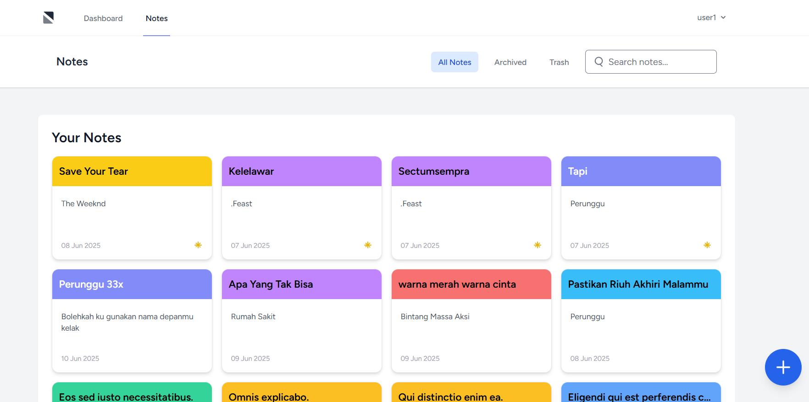

# 📝 NotesApp - Aplikasi Pencatatan Sederhana



Sebuah aplikasi pencatatan sederhana namun kuat yang dirancang untuk membantu Anda menangkap dan mengelola ide-ide dengan cepat dan efisien. Proyek ini dibangun sebagai bagian dari portofolio untuk menunjukkan kemampuan pengembangan web menggunakan ekosistem Laravel.

---

## ✨ Fitur Utama

Aplikasi ini dilengkapi dengan serangkaian fitur yang lengkap untuk pengalaman pengguna yang modern:

* **🔐 Otentikasi Pengguna:** Sistem login dan registrasi yang aman menggunakan Laravel Breeze.
* **📝 CRUD Penuh:** Buat, Baca, Update, dan Hapus catatan dengan mudah.
* **📌 Pin & Unpin:** Prioritaskan catatan penting dengan menyematkannya di bagian atas daftar.
* **🎨 Label Warna:** Kategorikan catatan Anda secara visual dengan label warna yang dapat disesuaikan.
* **📦 Arsip & Unarsip:** Simpan catatan yang tidak lagi aktif tanpa harus menghapusnya.
* **🗑️ Sampah & Pemulihan (Soft Deletes):** Catatan yang dihapus akan masuk ke "Trash" dan bisa dipulihkan atau dihapus permanen.
* **⏳ Hapus Otomatis:** Catatan di dalam "Trash" akan dihapus permanen secara otomatis setelah 30 hari menggunakan Laravel Scheduler.
* **🔍 Pencarian Cepat (Live Search):** Cari catatan berdasarkan judul atau isi secara instan tanpa me-reload halaman.
* **📄 Paginasi:** Menangani data dalam jumlah besar dengan efisien.
* **💅 UI Responsif & Modern:** Didesain dengan Tailwind CSS dan interaktivitas dari Alpine.js.

---

## 🛠️ Teknologi yang Digunakan

Proyek ini dibangun menggunakan tumpukan teknologi modern yang populer:

* **Backend:** PHP 8.x, Laravel 10.x
* **Frontend:** Blade, Tailwind CSS, Alpine.js
* **Database:** MySQL
* **Server Development:** Laravel Valet (atau bisa dijalankan dengan `php artisan serve`)

---

## 🚀 Instalasi & Setup Lokal

Untuk menjalankan proyek ini di lingkungan lokal Anda, ikuti langkah-langkah berikut:

1.  **Clone repository ini:**
    ```bash
    git clone [URL_REPOSITORY_ANDA]
    cd [NAMA_FOLDER_PROYEK]
    ```

2.  **Install dependensi PHP:**
    ```bash
    composer install
    ```

3.  **Install dependensi JavaScript:**
    ```bash
    npm install
    ```

4.  **Setup file environment:**
    ```bash
    cp .env.example .env
    ```

5.  **Generate application key:**
    ```bash
    php artisan key:generate
    ```

6.  **Konfigurasi database Anda di file `.env`:**
    ```env
    DB_CONNECTION=mysql
    DB_HOST=127.0.0.1
    DB_PORT=3306
    DB_DATABASE=notes_app
    DB_USERNAME=root
    DB_PASSWORD=
    ```

7.  **Jalankan migrasi dan seeder database:**
    ```bash
    php artisan migrate --seed
    ```

8.  **Compile aset frontend:**
    ```bash
    npm run dev
    ```

9.  **Jalankan development server:**
    ```bash
    php artisan serve
    ```

    Aplikasi sekarang akan berjalan di `http://127.0.0.1:8000`.

---

## 👨‍💻 Dibuat Oleh

Dibuat dengan ❤️ oleh **[Ravly Ramdhani]**.

Saya seorang Full-Stack Developer yang bersemangat dalam membangun aplikasi web yang bersih, efisien, dan ramah pengguna.

* **GitHub:** []([https://github.com/RavLyr])
* **LinkedIn:** []([https://www.linkedin.com/in/ravlyramdhani/])
* **Portofolio/Website:** []([https://ravlyweb.netlify.app/])

---

## 📄 Lisensi

Proyek ini dilisensikan di bawah Lisensi MIT. Lihat file `LICENSE` untuk detail lebih lanjut.